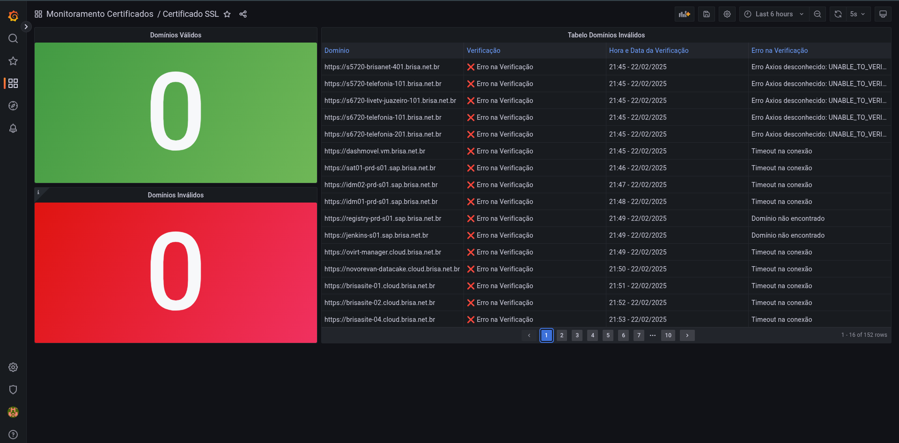

# Documentação do Projeto - Em andamento

## 1.0 Estrutura do script

O script segue uma estrutura lógica que executa algumas funções em sequência. Para garantir que o processamento seja feito de forma eficiente.

As principais funções do projeto são:

- testeValidadeUrl()
- testeSsl()

Há ainda as funções relacionadas ao banco de dados que fazem a conexão, inserção e fechamento da conexão com o banco.

### 1.1 Explicação sobre as funções

Nesse tópico irei explicar o funcionamento das principais funções.

#### 1.2 testeValidadeUrl()

A função `testeValidadeUrl()` recebe a lista de domínios que queremos testar. Ela faz testes para antes de chamar o `testssl.sh` verificar se a URL está com alguma erro relacionado a problemas de certificado, DNS, timeout e etc.

A função separa os domínios em duas listas. 

- listaUrlValidas
- listaUrlInvalidas

Os domínios que estão funcionando normalmente caem na lista de `validas` e são retornados ao final da função para serem utilizados na próxima função.

Os domínios inválidos são inseridos no banco de dados ao final de cada verificação.

#### 1.3 testeSsl()

A função `testeSsl()` recebe como parâmetro a lista de domínios válidos para prosseguir com a verificação de cada domínio com o binário do `testssl.sh`.

Ao final de cada verificação com o testssl.sh é gerado um arquivo `resultado.txt` que armazena a saída do comando. Após isso, nós analisamos o arquivo e coletamos as informações essencias para inserirmos em nossa tabela no banco de dados.

#### Mas por qual motivo escolhemos jogar a saído do comando em um arquivo `.txt`?

Bom, a resposta para essa pergunta é simples. Quando escolhiamos que o resultado fosse salvo em um arquivo json, o arquivo json era muito estranho, não sendo possível realizar a coleta das informações que queriamos de forma eficiente. Dessa forma, com o arquivo `.txt` gerado conseguimos extrair de uma forma mais eficiente as informações que queremos salvar no banco de dados.

## 2.0 Estrutura do Banco de Dados

A estrutura do banco de dados segue esse padrão:

- Tabela `monitoramento_ssl`

- Colunas

    - id
    - dominio
    - common_name
    - data_teste
    - dias_para_expirar
    - verificacao_status
    - certificado_valido
    - algoritmo_assinatura
    - vulnerabilidades_encontradas
    - detalhes_vulnerabilidades
    - nota_final
    - erro_na_verificacao

Aqui estão alguns detalhes sobre as informações que as colunas armazenam.

### 2.1 Colunas

##### Coluna: dominio

Aqui é o nome do domínio

##### Coluna: commom_name

O nome comum do certificado SSL.

##### Coluna: data_teste

Data que o teste rodou.

##### Coluna: dias_para_expirar

Em vez da quantidade de dias para expirar, que tal pegarmos todo o campo `Certificate Validity (UTC)   62 >= 60 days (2025-02-03 08:36 --> 2025-04-28 08:36)`. Assim, registramos a data de inicío e a data de validade para no Grafana fazer o cálculo direto na consulta.

##### Coluna: verificacao_status

Aqui seria o campo que indica se a verificação ocorreu ou não. Ou seja, se o teste para na primeira função que verifica a URL então esse campo recebe um `false`.

##### Coluna: certificado_valido

Verifica se o certificado é válido ou inválido, ou seja, se o certificado ainda não expirou ele será considerado válido.

##### Coluna: algoritmo_assinatura

Algoritmo usado pelo certificado SSL.

##### Coluna: vulnerabilidades_encontradas

Usado para refereciar se foram encontradas vulnerabilidades ao realizar o testessl.sh. Se existirem vulnerabilidades então o campo recebe um `true`.

##### Coluna: detalhes_vulnerabilidades

Informamos os detalhes das vulnerabilidades.

##### Coluna: nota_final

Pegamos a nota do certificado após rodar o testssl.sh.

##### Coluna: erro_na_verificacao

Se ocorrer erro na hora da verificação da URL. O erro é inserido no banco para uma analíse posterior.


### 2.2 Crie uma tabela para fins de teste localmente.

```bash
    CREATE DATABASE monitoramento;
```

```bash
    CREATE TABLE monitoramento_ssl (
        id SERIAL PRIMARY KEY,
        dominio VARCHAR(100) NOT NULL,
        common_name VARCHAR(255) NOT NULL,
        data_teste TIMESTAMP NOT NULL,
        verificacao_status BOOLEAN NOT NULL,
        data_inicio_validade TIMESTAMP NULL,
        data_fim_validade TIMESTAMP NULL,
        certificado_valido BOOLEAN NULL,
        algoritmo_assinatura VARCHAR(30) NULL,
        vulnerabilidades_encontradas BOOLEAN NULL,
        detalhes_vulnerabilidades TEXT NULL,
        nota_final VARCHAR(10) NULL,
        erro_na_verificacao TEXT NULL
    );
```

## 3.0 Grafana

Usaremos o Grafana para realizar as consultas e montar os Dashboards. Aqui está um exemplo de um dashboard que podemos utilizar futuramente.



O Dashboard pode conter:

- Contadores de domínios válidos e inválidos
- Painel com os domínios válidos com o nome do domínio e a quantidade de dias que faltam para expirar.
- Tabela com os domínios que deram erro na verificação.
- Tabela com todos os domínios.